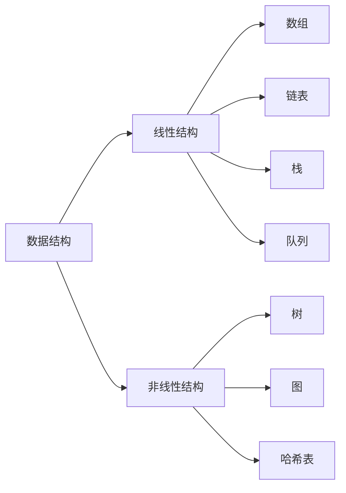

# 📊 算法与数据结构

欢迎来到算法学习模块！掌握算法和数据结构是成为优秀程序员的必经之路。

## 📚 学习路径

  
🏗️

  <h3>数据结构</h3>
  
数组、链表、栈、队列、树、图等基础数据结构的原理与实现。

  <a href="/algorithm/data-structure/array-linkedlist">开始学习 →</a>

  
🎯

  <h3>LeetCode 刷题</h3>
  
精选 LeetCode 题目，详细解析与代码实现，提升算法能力。

  <a href="/algorithm/leetcode/">开始刷题 →</a>

  
📈

  <h3>排序算法</h3>
  
冒泡、快速、归并等经典排序算法的原理与复杂度分析。

  <a href="/algorithm/sorting/">了解排序 →</a>

## 🎯 算法复杂度速查

| 复杂度 | 名称 | 示例 |
|--------|------|------|
| O(1) | 常数 | 数组访问、哈希表查找 |
| O(log n) | 对数 | 二分查找 |
| O(n) | 线性 | 遍历数组 |
| O(n log n) | 线性对数 | 快速排序、归并排序 |
| O(n²) | 平方 | 冒泡排序、嵌套循环 |
| O(2ⁿ) | 指数 | 递归斐波那契 |

## 💡 学习建议

::: tip 刷题技巧
1. **先理解题目**：仔细阅读题目，明确输入输出和约束条件
2. **思考解法**：先想暴力解法，再优化时间和空间复杂度
3. **手写代码**：在纸上或白板上写代码，模拟面试环境
4. **总结归纳**：按类型归类题目，总结通用解法模式
:::

## 📊 数据结构可视化

