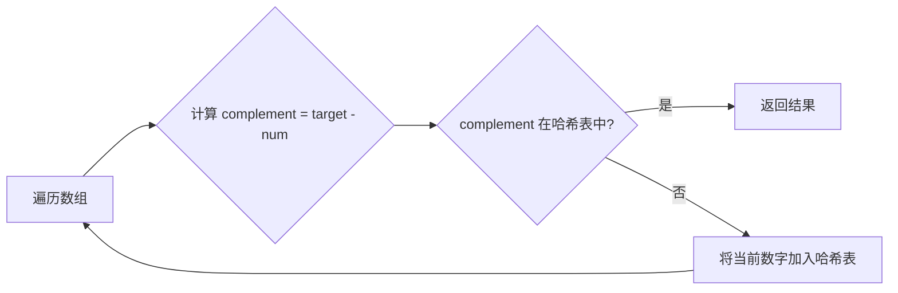

# LeetCode 001: Two Sum (两数之和)

## 题目描述

给定一个整数数组 `nums` 和一个整数目标值 `target`，请你在该数组中找出和为目标值的那两个整数，并返回它们的数组下标。

::: info 题目信息
- 难度：简单
- 链接：[LeetCode 1](https://leetcode.com/problems/two-sum/)
- 标签：数组、哈希表
:::

## 示例

```
输入：nums = [2, 7, 11, 15], target = 9
输出：[0, 1]
解释：因为 nums[0] + nums[1] == 9 ，返回 [0, 1]
```

## 解法一：暴力枚举

::: code-group
```python [Python]
def twoSum(nums, target):
    n = len(nums)
    for i in range(n):
        for j in range(i + 1, n):
            if nums[i] + nums[j] == target:
                return [i, j]
    return []
```

```javascript [JavaScript]
function twoSum(nums, target) {
    for (let i = 0; i < nums.length; i++) {
        for (let j = i + 1; j < nums.length; j++) {
            if (nums[i] + nums[j] === target) {
                return [i, j];
            }
        }
    }
    return [];
}
```
:::

**复杂度分析**
- 时间复杂度：O(n²)
- 空间复杂度：O(1)

## 解法二：哈希表（推荐）

::: code-group
```python [Python]
def twoSum(nums, target):
    hash_map = {}
    for i, num in enumerate(nums):
        complement = target - num
        if complement in hash_map:
            return [hash_map[complement], i]
        hash_map[num] = i
    return []
```

```javascript [JavaScript]
function twoSum(nums, target) {
    const map = new Map();
    for (let i = 0; i < nums.length; i++) {
        const complement = target - nums[i];
        if (map.has(complement)) {
            return [map.get(complement), i];
        }
        map.set(nums[i], i);
    }
    return [];
}
```
:::

**复杂度分析**
- 时间复杂度：O(n)
- 空间复杂度：O(n)

## 图解思路



## 关键点

1. **使用哈希表优化查找**：将 O(n) 的查找优化为 O(1)
2. **一次遍历完成**：边遍历边存储，避免重复遍历
3. **理解互补数概念**：`complement = target - num`

## 扩展

- 如果数组已排序，可以使用双指针法
- 如果需要返回所有满足条件的组合，需要修改算法

::: tip 面试建议
这道题是面试常考题，建议熟练掌握哈希表解法，并能够分析时间和空间复杂度。
:::

## 相关题目

- [167. 两数之和 II - 输入有序数组](https://leetcode.com/problems/two-sum-ii-input-array-is-sorted/)
- [15. 三数之和](https://leetcode.com/problems/3sum/)
